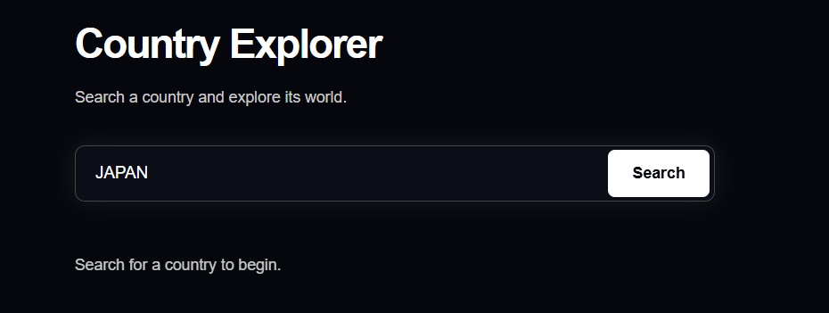
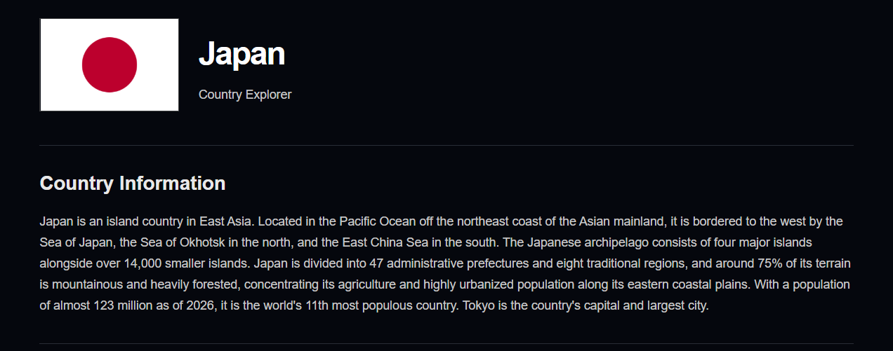
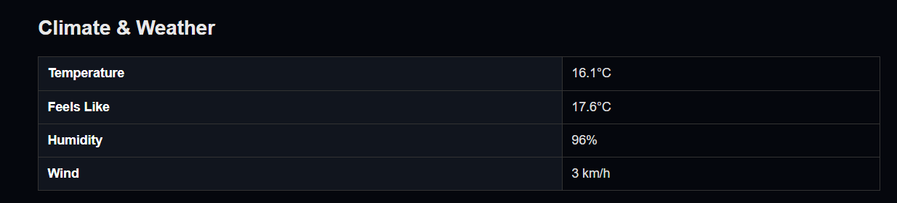
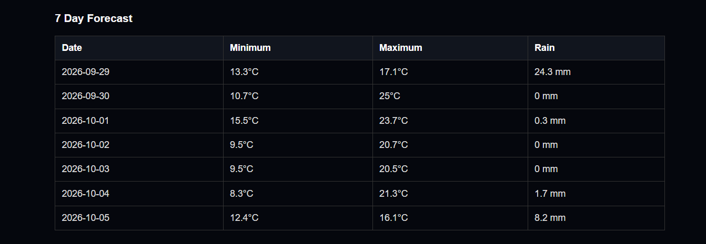
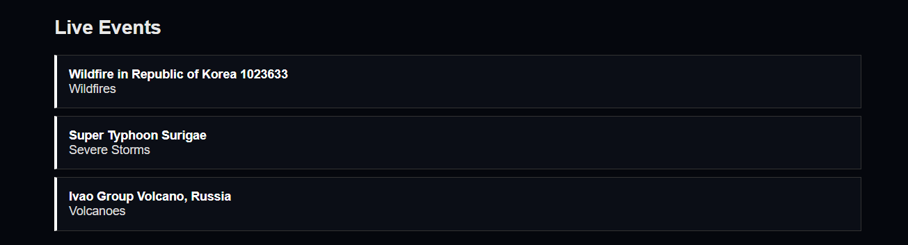

**# Country Explorer**

[](https://github.com/akashsuu/country-info)
[](https://vitejs.dev/)
[](https://developer.mozilla.org/en-US/docs/Web/JavaScript)
[](https://api.nasa.gov/)

Country Explorer is a web project where you can search for a country and explore its information, weather, live events, and NASA imagery.

**## Main Features**

* Country Information

* Climate & Weather

* 7 Day Forecast

* Live Events

* NASA space and satellite imagery

* Country images and details

**## Preview**

**### Search**



**### Country Information**



**### Climate & Weather**



**### 7 Day Forecast**



**### Live Events**



**## APIs**

* Wikipedia API

* Open-Meteo API

* NASA APIs

* NASA EONET

* NASA Images API

**## Technologies**

* HTML

* CSS

* JavaScript

* Vite

**## Setup**

```bash

npm install

```

Create a `.env` file:

```env

VITE_NASA_API_KEY=your_nasa_api_key

```

Run the project:

```bash

npm run dev

```

Then open the local URL provided by Vite.
